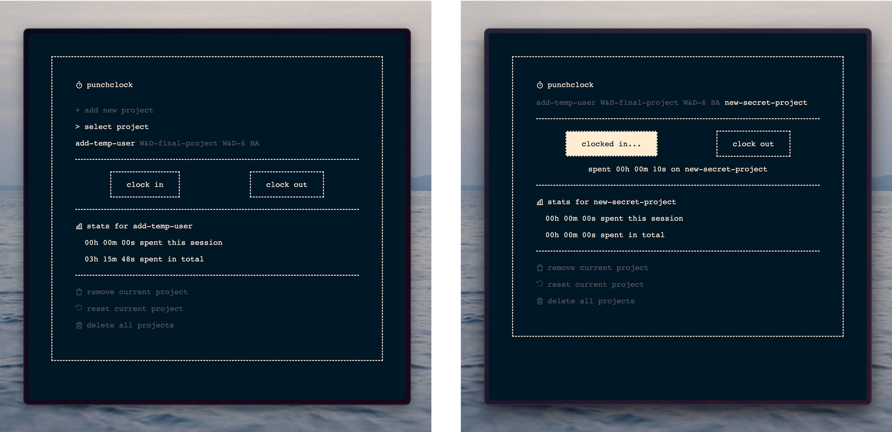

# `punchclock`

`punchclock` is a minimal project timer designed to quickly record work hours or any other time spent.
Add a project, clock in, and when you're done, clock out.

### Basic UI and `clocked in`

### Keyboard Shortcuts

- `Ctrl` + `A` to open `+ Add Project` dialogue
- `Esc` and `Enter` to cancel and save new project
- `Space` to clock in/clock out
- `Ctrl` + `C` to open Launcher and type a project to clock into (and create)

### Additional Info

Projects and time spent are stored via `localStorage`, making the app as small as the `index-file` and `jquery` (currently just 98KB).

Currently, a dark and light theme is available and automatically set according to system settings. 
Icons are from [Phosphor Icons](https://phosphoricons.com/), the preffered font is Menlo.

## development roadmap

As a personal project, `punchclock` is not too high on my agenda, but over time I'd like to add:

- [x] keyboard shortcuts
- [ ] launcher
	- [x] basic launcher
	- [ ] project list, navigable by `↑` and `↓`.
- [x] customized color schemes
- [x] Editing
	- [x] edit titles
	- [x] edit time
- [ ] a timing log that stores session lengths and enables deeper statistics
- [ ] Deeper Statistics
	- [ ] time spent daily, weekly, monthly
	- [ ] project distribution
- [ ] Exporting log files
	- [ ] work report card
